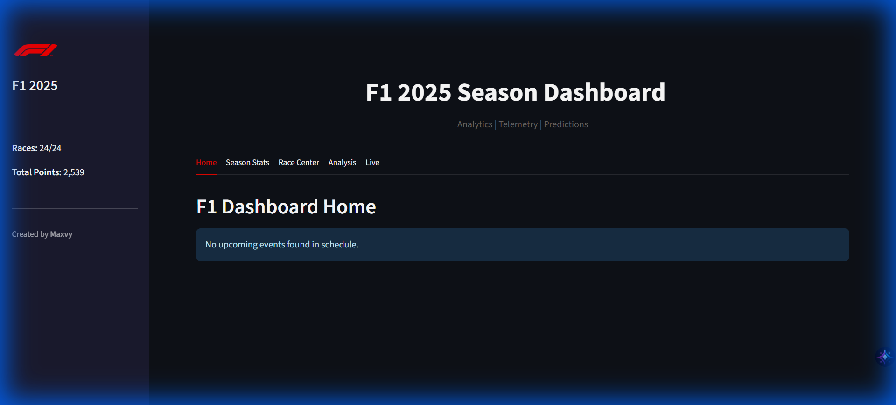

# F1 Analytics Platform

[](https://www.python.org/)
[](https://streamlit.io/)
[](https://github.com/theOehrly/Fast-F1)
[](LICENSE)

Real-time Formula 1 analytics dashboard for the 2025 season.



## Quick Start

```bash
git clone https://github.com/your-username/f1-analytics.git
cd f1-analytics
pip install -r requirements.txt
streamlit run f1.py
```

## Features

- Season Overview & Standings
- Driver & Team Profiles
- Race Analysis & Telemetry
- Race Replay (Desktop + Web)
- ML Predictions
- Live Timing

## Structure

```
f1-analytics/
├── f1.py                 # Main app (streamlit run f1.py)
├── config.py             # Constants & settings
├── analysis.py           # Stats calculations
├── loader.py             # CSV data loading
├── model.py              # ML predictions
├── fastf1_extended.py    # Telemetry data
├── advanced_viz.py       # Visualizations
├── race_replay_*.py      # Replay system
├── data/                 # CSV datasets
├── notebooks/            # Analysis notebooks
└── tests/                # Test suite
```

## License

MIT
